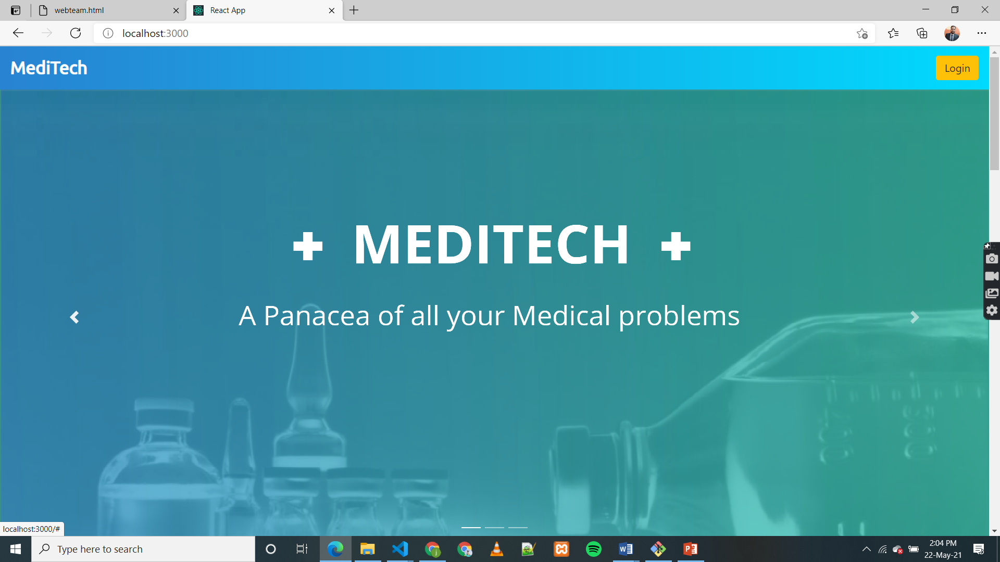
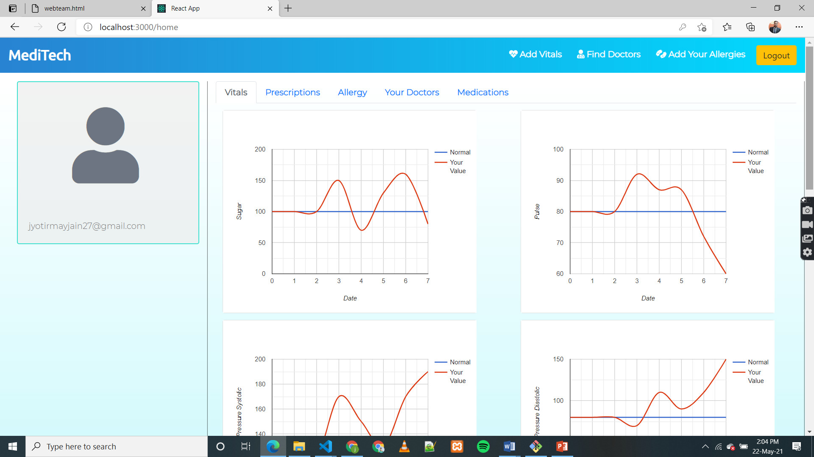
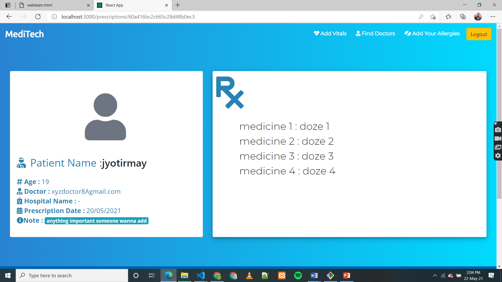
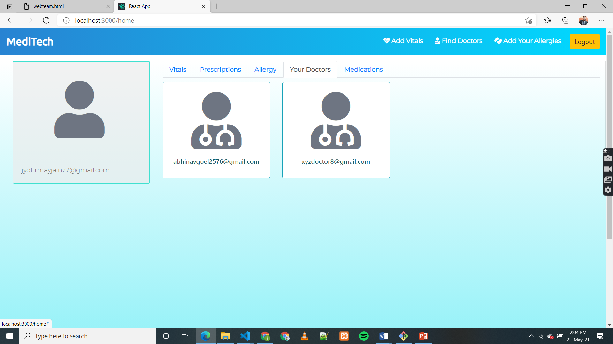
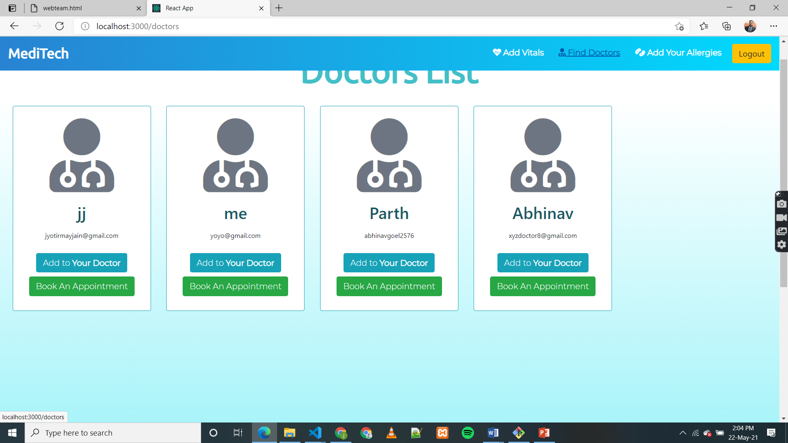
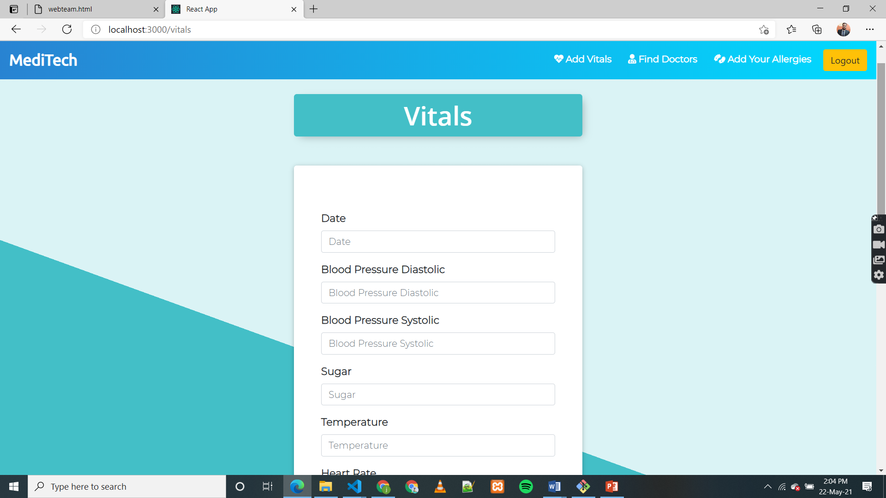

# MediTech

## Getting Started

A Health Assistance Website which will help doctors and patients to access patient’s medical history and effects.

## Presentation Link
https://drive.google.com/file/d/1JuM7Lz3WyOylj5ZUW5Qpgv9LzQtiSwaz/view?usp=sharing

## Video

[![Watch the video]](https://www.youtube.com/watch?v=HcVd1OyeAN4&t=3s)

## Tech Stack

1. Node js
2. Express js
3. React js
4. JavaScript
5. MongoDB
6. CSS
7. HTML
8. Bootstrap

### Installation instructions
1. Download LTS or Current version of Node js from https://nodejs.org/en/ .
2. In cmd type 'node' to get sure if node is present.
3. Run npm install command in it
4. Now make a React App. Follow instruction written in the documentation https://reactjs.org/docs/create-a-new-react-app.html.

```
npx create-react-app my-app
cd my-app
npm start
```

```
In your project do npm init or npm install, install dependencies and you are good to go.
```


```
Frontend Dependencies:-

• npm install --save react-bootstrap
• npm install --save react-dom
• npm install --save @fortawesomefontawesome-svg-core 

• npm install --save 
@fortawesome/free-solid-svg-icons

• npm install --save @fortawesome/react-fontawesome
• npm install --save react-transition-group
• npm install --save react-spring
• npm install --save react-scripts
• npm install --save react-router-dom
• npm install --save react-reveal
• npm install --save react-google-charts
• npm install --save react-datepicker
• npm install --save bootstrap

```

```
Backend Dependencies:-

• npm install --save bcryptjs
• npm install --save body-parser
• npm install --save express
• npm install --save express-validator
• npm install --save jsonwebtoken
• npm install --save mongoose
• npm install --save mongoose-unique-validator
• npm install --save nodemailer
• npm install --save nodemon
• npm install --save uuidv4

```
```
Note: After adding nodemon in package.json do changes:-
from
 "scripts": {
    "test": "echo \"Error: no test specified\" && exit 1"
  }
  to
   "scripts": {
    "test": "echo \"Error: no test specified\" && exit 1",
    "start": "nodemon app.js"
  }
```


## Features
0. Fully responsive site.
1.  Registration on the system with Name, Operating Company, and Enterprise Email ID as mandatory fields (All are  text fields)
2.	It will use password for the user or his doctor.
3.	To access patient’s regular vitals like BP, Sugar etc which will be entered by user and the website will make its graph from the inception.
4.	 All prescriptions by doctors will be kept as records (which will allow doctors to access their true medical history for proper diagnosis and for patients to refer later on). 
5.	A list of current going on medication (To avoid any particular side effect from any future prescribed medications).
6.	Profile of Doctors and hospitals with visiting address, contact number, specialities, available facilities etc.  
7.	List of all Allergies or Allergy inducing Medicines.
8.	Appointments with doctors can be booked.
9.	We can adjust the site according to situations like COVID to show the beds, oxygen, availability of resources etc for users.


## Screenshots
<p align="center">
  
  </p>
      <p align="center">
  
  </p>
      <p align="center">
  
  </p>
  <p align="center">
  
  </p>
  <p align="center">
  
  </p>
  <p align="center">
  
  </p>
    <p align="center">
  
  </p>
    <p align="center">
  
  </p>
 

